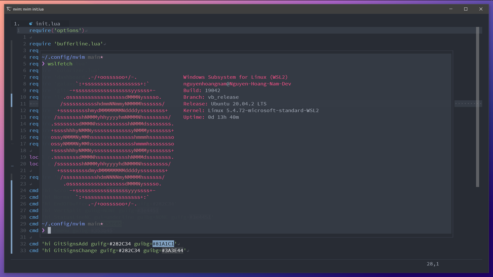
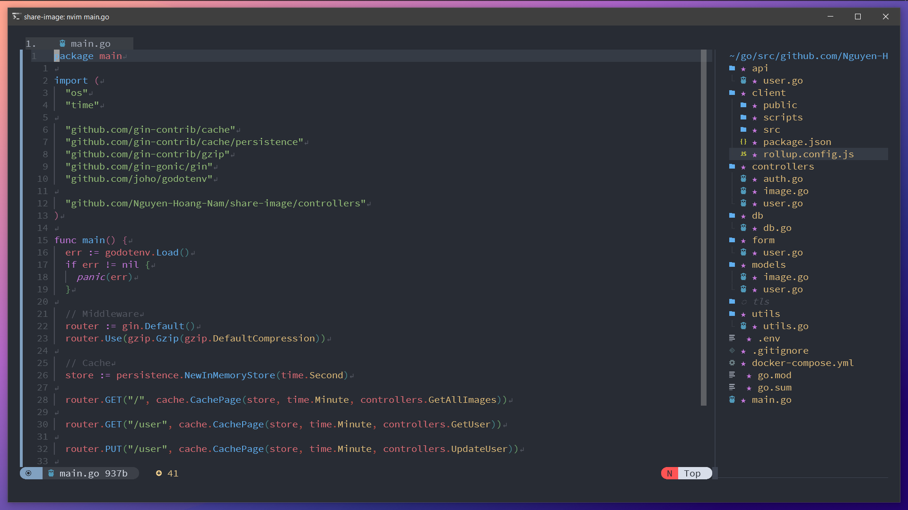
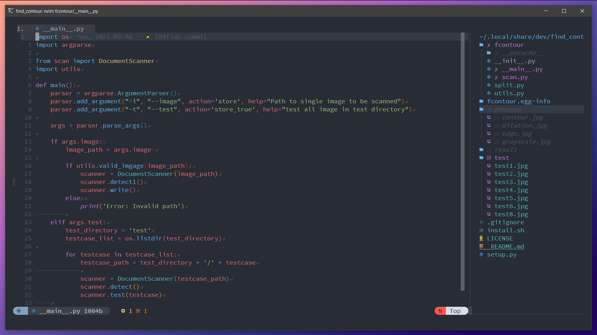
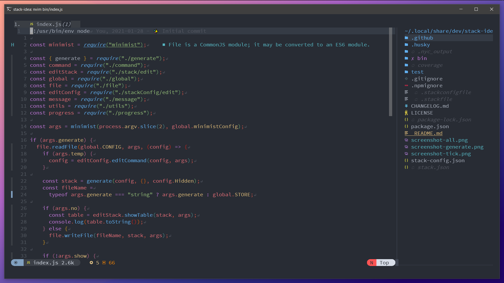

# Neovim Config for WSL2 🎵

🍕 Inspiring from siduck76/neovim-dots but wsl2

## 🙈 Differentation

- Support clipboard in WSL2 by using win32yank
- Use Floaterm to show terminal
- Show dashboard
- Show scrollbar
- Support preview markdown by using Glow
- Preview color by using vim-hexokinase
- Support fuzzy find gitmoji
- Show eol icon
- Alway show help in vertical
- Show nvim-tree in right
- Use theme moonfly
- Hide close icon in buffer line

## 🗺 Mappings

- Auto indent when paste
- Moving line up, down by Alt + k/j
- Open terminal Alt + t
- Comment code Space + /
- Preview markdown Space + r
- Find file Space + p
- Find gitmoji Space + e

## 🚀 LSP config

- Support javascript, typescript
- Support svelte
- Support CSS
- Support golang
- Support python

## 🔧 Neoformat

- Go: goimport, gofumpt
- CSS: prettier
- Javascript: prettier
- Markdown: prettier

## 📷 Screenshot

#### Golang

#### Python

#### Javscript

